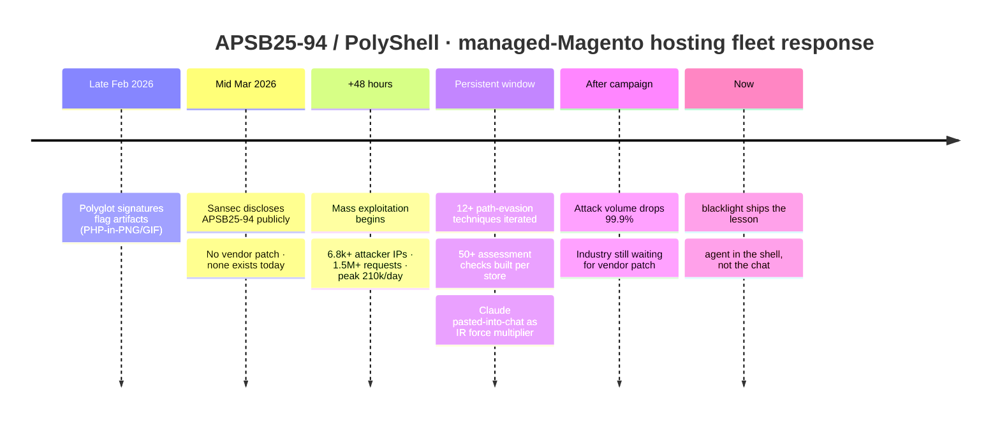
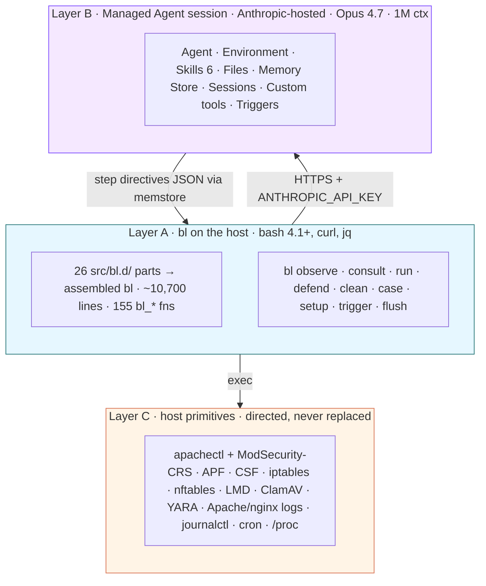
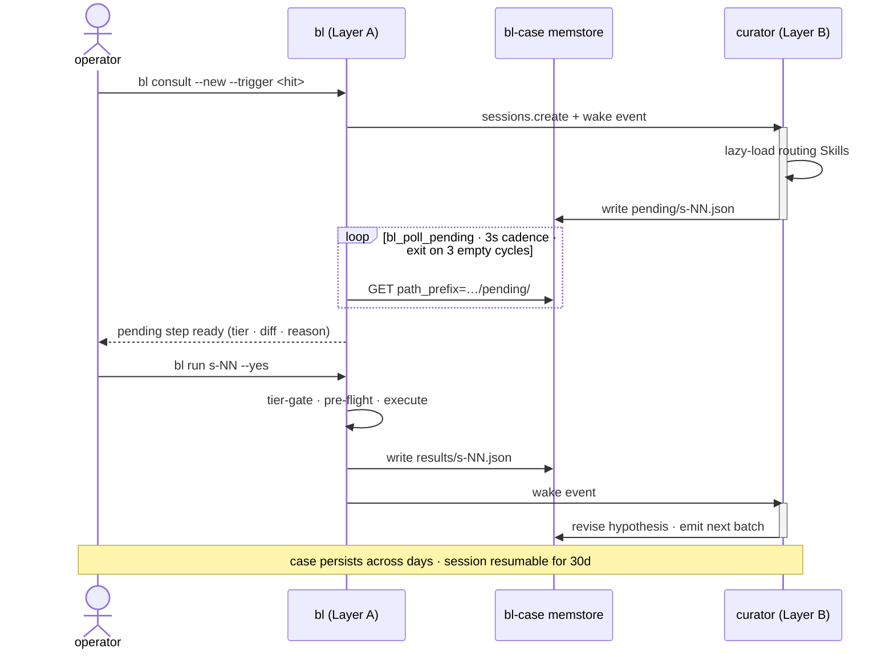
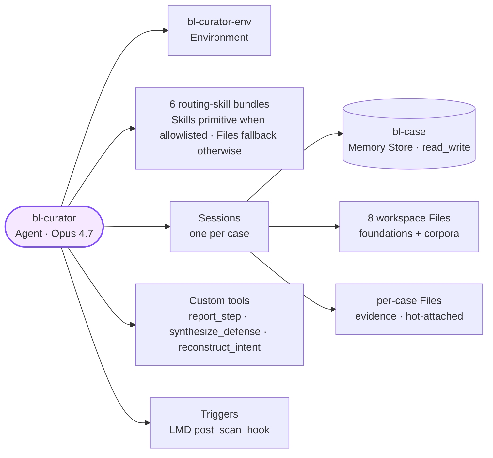

<div align="center">

# blacklight

**Defenders run grep. Attackers run agents. `bl` is the counter.**

A portable bash CLI that puts an agent on the same Linux defensive stack you already run.  
**Observe · Decide · Act · At fleet scale.**

<a href="https://blacklight.rfxn.com"></a>

[](https://github.com/rfxn/blacklight/tags)
[](LICENSE)
[](#why-this-stack)
[](#proof)
[](#why-this-stack)
[](#why-this-stack)

[Install](#install) · [Try it](#try-it-apsb25-94-in-five-minutes) · [Architecture](#architecture) · [Why this stack](#why-this-stack) · [Safety](#safety-model-five-tiers-eight-mechanics) · [Roadmap](#roadmap)

</div>

> [!IMPORTANT]
> **v0.6.1 build, originally written April 2026.**
> Production-shape, not production-tested at fleet scale. External operator beta is roadmap P1.
> The full docs site at [**blacklight.rfxn.com**](https://blacklight.rfxn.com) is the richer surface: this README, design notes, recorded trace, and operator collateral, all rendered with proper navigation.

---

<p align="center">
<strong><em>The agent doesn't belong in a chat window.<br/>
It belongs in the shell, on the host, holding the case across days,<br/>
acting on the substrate the defender already runs.</em></strong>
</p>

---

## What blacklight does

At 03:42 UTC on a Saturday, the APSB25-94 advisory drops: Magento stores are actively backdoored via a double-extension webshell hidden in the media cache. Eight hours later the on-call team has run `grep`, `find`, ModSec audit scrapes, ClamAV scans, APF drops, and crontab audits across forty hosts, by hand.

**blacklight collapses that arc into agentic-minutes** on the same Linux substrate you already run. The agent in the shell, not the chat. A Managed Agent curator holds the case across days; the wrapper observes, gates, and acts on the host. No platform buy-in. No fleet migration. No analyst retraining.

The power is the act, not the chat. `bl defend` pushes a ModSec rule with `apachectl -t` pre-flight and a backup. `bl defend firewall` drops an attacker IP across APF / CSF / iptables / nftables, CDN-safelist aware, with a TTL retire timer. `bl defend sig` appends an FP-gated signature to LMD / ClamAV. `bl clean` quarantines a webshell, removes a poisoned cron, kills a beacon process, with diff and undo. Same operator vocabulary, on the same hosts, now agent-directed at fleet pace.

---

## Install

```bash
curl -fsSL https://raw.githubusercontent.com/rfxn/blacklight/main/install.sh | sudo bash
export ANTHROPIC_API_KEY="sk-ant-..."
bl setup
```

Floor: bash 4.1+, curl, jq. RPM and DEB packaging under `pkg/`. `bl setup` is one-time per Anthropic workspace; see [`docs/setup-flow.md`](docs/setup-flow.md).

---

## Try it: APSB25-94 in five minutes

> [!NOTE]
> Output is illustrative, shaped by the public APSB25-94 advisory. The full recorded trace lives at [`tests/live/evidence/`](tests/live/evidence/); regenerate with `make live-trace` (requires `ANTHROPIC_API_KEY`).

**1. Collect Apache logs and check the filesystem:**

```bash
bl observe log apache --around /var/www/html/pub/media/catalog/product/.cache/a.php --window 6h
bl observe fs --mtime-since 2026-03-20T00:00:00Z --under /var/www/html --ext php
```

**2. Open a case; the curator proposes the next step:**

```bash
bl consult --new --trigger "APSB25-94 double-extension webshell, obs-0001 obs-0002"
```

```
blacklight: CASE-2026-0001 opened
blacklight: pending step s-0043 ready
  verb:    defend.modsec
  tier:    suggested
  reason:  obs-0001 + obs-0002 confirm polyshell staging pattern
  diff:    +SecRule REQUEST_FILENAME "@rx \.php/[^/]+\.(jpg|png|gif)$" \
              "id:941999,phase:2,deny,log,msg:'polyshell double-ext staging'"
Confirm and apply? [y/N]
```

**3. Apply the rule (tier-gated, `apachectl configtest` pre-flight, backup written):**

```bash
bl run s-0043 --yes
```

```
blacklight: s-0043 defend.modsec [suggested]: applying
  apachectl -t ... OK
  rule installed: /etc/apache2/mods-enabled/bl-CASE-2026-0001-941999.conf
  apache2ctl graceful ... OK
blacklight: ledger event defend_applied written
```

The full motion (observation → consult → defense → clean → case close) is exercised end-to-end by [`tests/live/setup-live.bats`](tests/live/setup-live.bats).

---

## Verify yourself

An operator can verify install + smoke + version in under 60 seconds without an Anthropic API key:

```bash
git clone https://github.com/rfxn/blacklight && cd blacklight
make bl                                       # assemble bl from src/bl.d/NN-*.sh
./bl --version                                # → bl 0.6.1
./bl --help                                   # nine-namespace surface
make -C tests test-quick                      # 00-smoke + 01-cli-surface (~70s)
ls schemas/ skills/ routing-skills/ skills-corpus/   # 6 skill primitives + 8 corpora
git log --oneline | head -20                  # commit cadence
```

| Suite | Command | Coverage |
|---|---|---|
| Inner-loop | `make -C tests test-quick` | 00-smoke + 01-cli-surface (~70s) |
| Pre-commit | `make -C tests test` + `make -C tests test-rocky9` | 404 BATS, fixture-driven |
| Release | `make -C tests test-all` | 6-distro matrix (debian12, rocky9, ubuntu2404, centos7, rocky8, ubuntu2004) |
| Live API | `make live-trace` | `BL_LIVE`-gated; requires `ANTHROPIC_API_KEY` |

> [!TIP]
> The test suite never makes a live API call. `tests/helpers/curator-mock.bash` shims `curl` against `tests/fixtures/step-*.json`. Anyone without an API key can run the full 404-test suite.

---

## Why this exists: APSB25-94 in production

In **mid-March 2026**, [Sansec](https://sansec.io) publicly disclosed **PolyShell** as part of [APSB25-94](https://helpx.adobe.com/security/products/magento/apsb25-94.html), an unauthenticated file-upload RCE affecting **every version** of Magento 2 Community Edition and Adobe Commerce. **No vendor patch existed at disclosure. None exists today.** Mass exploitation began within 48 hours.



We ran the response across a managed-Magento hosting fleet of a thousand-plus servers. The shape of what hit, drawn from public field reporting on the campaign:

- **6,800+ unique attacker IPs** across multiple threat groups with separate C2 infrastructure
- **1.5M+ malicious requests, peaking at 210,000/day**
- **12+ path-evasion techniques** iterated in real time
- A separate upload vector traced back **months before public disclosure**
- Post-compromise C2 beacons, secondary backdoors, and JavaScript payment skimmers

Polyglot signatures had been flagging the artifacts since late February: PHP hidden inside valid GIF and PNG images, shells on disk that looked harmless to every file-type check. Some layers held. Some didn't. Attackers found evasion paths that bypassed initial WAF mitigations, and we iterated rules through the persistent attack window. We built **50+ assessment checks per store** mid-incident because existing tools didn't give us the coverage the threat demanded. After the industry-wide persistent attack pattern, **attack volume dropped 99.9%**, while the rest of the industry continued to wait for a patch that still does not exist.

**Where Claude entered.** Through that window, Claude was central to keeping pace. Every analyst was pasting evidence into chat, getting forensic synthesis back, and applying the result by hand. The lesson by the end of the campaign was not "AI helps with IR." The lesson was: **the agent doesn't belong in a chat window. It belongs in the shell, on the host, holding the case across days and acting on the substrate the defender already runs.** **blacklight is that lesson shipped**: the agent-directed CLI we wished we'd had on day 1.

> [!NOTE]
> Authored from the experience of responding to APSB25-94 and the alarming pace of incidents like it through the last year: unauthenticated RCEs without vendor patches, polyglot webshells past file-type checks, evasion outpacing remediation. blacklight is that response, distilled so other defenders can run it from minute one. Corpus in [`exhibits/fleet-01/`](exhibits/fleet-01/) rebuilds APSB25-94 from public sources only (Adobe advisory, Sansec analyses, OWASP CRS, Magento docs). No customer data, no internal IOCs.

---

## Who this is for

Most defensive teams are not on Charlotte. They are running ModSecurity, Apache, iptables, nftables, ClamAV, fail2ban, syslog, cron (the OSS Linux defensive stack the industry has built since 2002), and they do not have an enterprise EDR contract, a dedicated security team, or runway for a multi-quarter platform rollout. blacklight is the agentic-defensive baseline for that audience: drop in over an existing stack, plug in an Anthropic API key, and the operator has a curator-driven case desk on the same hosts they already maintain. The art of the possible, at the edge of what is possible, in bash, today.

| Operator profile | What `bl` gives them |
|---|---|
| **L1 SOC analyst** at a managed hosting provider or MSP | `bl trigger <hit>` opens a case from any post-scan hook; the curator drives observation, defense, and cleanup. The L1 confirms tier-gated steps. |
| **Sysadmin / DevOps without dedicated security headcount** | The agent IS the security team for the case. No SIEM, no SOAR, no extra analysts. One key, one bash file, one curator session resumable for 30 days. |
| **L2 engineer** running open Linux infrastructure | One curator session per case, resumable for 30 days. New evidence attaches via the Files API; the curator extends the hypothesis instead of restarting. |
| **Hosting product owner / sysadmin on small fleets** | GPL v2, zero license cost, single bash file, `$ANTHROPIC_API_KEY` is the only credential. Operator pays Anthropic API usage; that is the entire cost. |
| **Defender already running rfxn tools** (LMD/APF/BFD) | First-class trigger adapter for LMD `post_scan_hook`; same install discipline and operator vocabulary as the existing rfxn portfolio. |

`bl` does not require LMD/APF/BFD. It directs whatever defensive primitives the host already has: Apache + ModSec, iptables, nftables, ClamAV, YARA, cron, journalctl. rfxn is one anchor case, not a precondition.

---

## How blacklight compares

The first wave of agentic defensive tooling, including **CrowdStrike Charlotte AI** (Falcon EDR/XDR), **Microsoft Security Copilot** (Sentinel + Defender + M365 E5), **Palo Alto Purple AI** (Cortex), and **Google SecLM / Duet for Security** (Chronicle), shares one structural constraint: the operator must be inside the vendor platform before the agent is available. The reasoning quality is real. The bottleneck is platform reach.

| Adoption barrier | Charlotte-class | blacklight |
|---|---|---|
| Platform onboarding | 3–18 months fleetwide | ~30 seconds (`curl \| bash`, then `bl setup`) |
| Per-endpoint licensing | $75–$250 / host / year | $0; only Anthropic API usage |
| SIEM/SOAR/IdP integration | Quarters of platform engineering | None; `bl` reads existing logs in place |
| Analyst retraining | Weeks to months on vendor DSL | Zero; operator vocabulary preserved |
| Extensibility | Vendor DSL detection authoring | Fork the repo; drop in a markdown skill |
| Lock-in | Per-vendor; migration cost compounds | None; wrapper and skills are GPL v2 |
| Works on CentOS 6 / RHEL 7 / Debian 10 | Rarely supported | Yes; bash 4.1 + curl is the floor |
| Compatible with $10/month customer margins | No | Yes |
| Auditable in 30 minutes | No (closed platform) | Yes (single bash file + markdown) |

Most defenders sit outside the EDR/XDR perimeter, running the OSS Linux defensive stack on the order of **hundreds of millions of hosts** Charlotte structurally cannot reach, working harder than they should because platform-bound tooling does not deploy where they live. blacklight is the counter for that gap: agentic defense on the substrate the defender already owns, with the floor at bash 4.1 and the ceiling at Opus 4.7. Full positioning in [`PRD.md`](PRD.md) §10.

---

## Architecture

Three layers, clear separation of concerns:



**Layer-boundary invariants.** Layer A executes; Layer B reasons; Layer C is untouched by blacklight source: no new rule engines, no new manifests, no new wire formats. Cases are agent-directed REPLs, not batch dossier analyses.

**Investigation flow** (async polled step-emit). The wrapper does not hold an SSE socket; the agent writes proposed step JSON to `bl-case/<case>/pending/<step-id>.json` and the wrapper polls.



Polling makes the case memory the self-documenting audit log, keeps `bl` short-lived per invocation, and absorbs agent latency invisibly. Full mechanical detail and the Managed Agents primitive map: [`DESIGN.md`](DESIGN.md) §3–§4.

---

## Command surface

Nine namespaces, one assembled bash binary. Per-verb help bypasses preflight (`bl <verb> --help` works on an unseeded workspace).

| Namespace | Purpose |
|---|---|
| `bl observe` | Read-only evidence: `file`, `log {apache\|modsec\|journal}`, `cron`, `proc`, `htaccess`, `fs`, `firewall`, `sigs`, `substrate`, `bundle`. JSONL out. |
| `bl consult` | Open or attach an investigation case via the `bl-curator` Managed Agent. |
| `bl run` | Execute an agent-prescribed step. Schema-validated, tier-gated, ledger-logged. `--list`, `--batch [--max <N>]`, `--dry-run`, `--explain`. |
| `bl defend` | Apply an agent-authored payload: `modsec` (rule apply / `--remove` / rollback), `firewall` (APF/CSF/iptables/nftables, CDN-safelist aware, `--retire <duration>`), `sig` (LMD/ClamAV append, FP-corpus gated). |
| `bl clean` | Diff-shown remediation: `file` (quarantine, never unlink), `htaccess`, `cron`, `proc` (capture-then-SIGTERM). `--undo`, `--unquarantine` round-trip. |
| `bl case` | Lifecycle: `show`, `list`, `log [--audit]`, `close`, `reopen`. |
| `bl setup` | Workspace bootstrap: `--sync`, `--reset --force`, `--gc`, `--eval`, `--check`, `--install-hook lmd`, `--import-from-lmd`. |
| `bl trigger` | Hook-driven case open. Today: LMD `post_scan_hook`. |
| `bl flush` | `--outbox` drains durable outbox of queued memstore writes (cron-driven); `--session-events [--case <id>]` syncs new curator `report_step` calls into memstore pending/ so `bl run` can dispatch them. |

Ten documented exit codes ([`docs/exit-codes.md`](docs/exit-codes.md)); 1–63 reserved for POSIX, 64–72 for blacklight semantics.

---

## Why this stack

### Managed Agents: the case IS the session

The curator is an Anthropic Managed Agent, not a stateless API call wrapped in a prompt. Open a case Monday, collect more evidence Tuesday, call `bl consult` again Friday; the curator already holds the hypothesis, the evidence index, the pending steps, and every prior revision. No re-prompt, no context reconstruction.

`bl setup` provisions the **full five-primitive Managed Agents surface** and persists every ID into a single `state.json`:



Pre-flight validation (`apachectl -t`) runs in the agent's own sandbox before any rule promotes to `pending/`. Skills mount as platform-routed Skills; edits propagate to the next session without code deploy. Workspace-scoped commercially: per-tenant isolation is platform-native, blacklight does zero multi-tenant engineering.

Live API surfaces verified against the `managed-agents-2026-04-01` beta header: `POST /v1/agents/<id>` (update), `POST /v1/agents/<id>/archive` (retire), `sessions.create` body `{ agent: <id>, ... }`. See [`docs/managed-agents.md`](docs/managed-agents.md).

### Opus 4.7 + 1M context: full-bundle correlation

A realistic APSB25-94-shaped case routinely accumulates **250,000 to 400,000 tokens** of raw evidence (Apache transfer + error, ModSec audit, FS mtime, crontabs, process snapshots, journalctl, maldet history) before the curator has authored a single hypothesis. Chunking destroys correlation: a retriever picking "top 5 evidence items" misses the one record that matters precisely because it does not look relevant in isolation.

The 1M context window makes full-bundle correlation possible without a retrieval layer. Opus 4.7 brings the forensic reasoning depth to distinguish a staging artifact from a false positive by applying ModSecurity grammar, Magento path conventions, and attacker TTPs simultaneously. A hot mid-investigation case lives at ~85K–120K tokens (8–12% of the window). Prompt caching amortizes the stable portion (skills + history); only the new evidence delta is uncached. [`exhibits/fleet-01/`](exhibits/fleet-01/) ships a deterministic, byte-identical, **~360k-token** APSB25-94 forensic bundle for stress verification.

### Three-tier model routing

| Surface | Model | Why |
|---|---|---|
| Curator (per-case session) | **`claude-opus-4-7`** | 1M context absorbs full case state without a retriever. Calibrated hypothesis revision is the trained behaviour. |
| `synthesize_defense` / `reconstruct_intent` | **`claude-opus-4-7`** | Multi-artifact consistency (rule + exception list + validation) and multi-layer deobfuscation (base64 → gzinflate → eval). |
| `bl observe bundle` summary render | **`claude-sonnet-4-6`** | Pattern condensation at speed and cost. Falls back to deterministic helper on `--no-llm-summary` or `BL_DISABLE_LLM=1`. |
| FP-gate adjudication (sig append) | **`claude-haiku-4-5`** | Binary-scan-passed signatures spot-checked before LMD/ClamAV append. Cheap, fast, schema-output. |

Curator calls are infrequent and expensive **by design**: they carry the full evidence bundle. Step-execution and FP-gating calls are frequent and cheap **by design**. Same model everywhere would either make investigations prohibitively expensive or leave the reasoning-intensive curator step under-resourced. `BL_DISABLE_LLM=1` short-circuits all LLM calls and forces deterministic fallbacks.

### Bash, the moat

The bash 4.1 + curl + jq runtime IS the commercial moat against Charlotte-class platforms, because Charlotte cannot deploy here either.

- **Portability floor: bash 4.1 from December 2009 (RHEL/CentOS 6 era).** Tens of millions of legacy hosting environments still run on or near this floor.
- **Pre-usr-merge handling.** CentOS 6 has coreutils at `/bin/`, modern distros at `/usr/bin/`. `bl` never hardcodes either; every coreutil call goes through the `command` builtin for portable PATH resolution.
- **Zero runtime daemons, zero databases, zero service ports.** State lives in `/var/lib/bl/` on the host (operator-owned) and the Anthropic workspace (operator-owned). `bl` exits when its operation completes.
- **Single secret = `$ANTHROPIC_API_KEY`.** No service account, no long-lived token, no mTLS, no certificate management. Workspace boundary is the blast radius of a compromised credential.
- **Distro matrix.** `make -C tests test-all` against debian12, rocky9, centos7, rocky8, ubuntu2004, ubuntu2404. CentOS 6 floor verified via `Dockerfile.centos6` on demand.

---

## Safety model: five tiers, eight mechanics

Every action is classified into one of five tiers; the wrapper enforces the gate based on the tier the agent declared, not on trust from the agent alone.

| Tier | Examples | Gate |
|---|---|---|
| **read-only** | `observe.*`, `consult` | Auto-execute, ledger entry only. |
| **auto** (reversible, low-risk) | `defend.firewall <new-ip>`, `defend.sig` (FP-gate passed) | Auto-execute + notification + 15-min veto window. |
| **suggested** (reversible, high-impact) | `defend.modsec` (new rule) | Operator confirmation required; `--yes` permitted at this tier. |
| **destructive** | `clean.*`, `defend.modsec --remove`, `case.close` | Diff shown; `--unsafe` AND `--yes` both required. Backup or quarantine entry written before the operation runs. |
| **unknown** | Anything that does not map to a known verb | Deny by default. Exit 68 (`TIER_GATE_DENIED`). |

Layered mechanics: **schema validation** (`schemas/step.json`, both platform and wrapper), **prompt-injection fence** (session-unique token; injection routes to `open-questions.md`), **backup-before-apply** (`/var/lib/bl/quarantine/`), **quarantine-not-delete**, **CDN-safelist-aware firewall**, **FP corpus gate** (deterministic scan + Haiku 4.5 spot-check), **append-only ledger under `flock` FD 200**, **durable outbox** (memstore retries via `bl flush`).

Full safety policy: [`docs/security-model.md`](docs/security-model.md), [`docs/action-tiers.md`](docs/action-tiers.md).

---

## Skills bundle

Operator-voice knowledge is the moat. The bundle is grounded in twenty-five years of Linux hosting security operations, authored from public sources only (Adobe advisories, ModSecurity grammar, Magento developer docs, Linux hosting-stack documentation, public YARA repositories), never operator-local data.

| Surface | Path | Count | Role |
|---|---|---|---|
| Raw research substrate | `skills/` | 23 dirs / 73 files | Operator-voice knowledge files, grounded in lived experience |
| Routing-skills | `routing-skills/` | 6 bundles | Platform Skills primitives when workspace is allowlisted; uploaded as workspace Files in the submitted build |
| Workspace corpora | `skills-corpus/` | 8 markdown corpora | Mounted as Files at session create; always present |

**Routing model:** the legacy `bl-skills` memory store is **retired**. Routing-skills upload as Skills primitives when the workspace is allowlisted for `/v1/skills`; in the submitted build, Anthropic's Skills endpoint is allowlist-gated for this workspace, so the bundles upload through the Files surface instead. The architectural shape (description-routed selection, per-turn lazy load) is the upgrade path once allowlist propagates; the file-fallback is feature-equivalent at the corpus level and degrades only the per-turn token bound.

**Authoring discipline (non-negotiable):** each skill opens with a scenario from lived experience, states a non-obvious rule, gives one concrete example drawn from public APSB25-94 material, and names a failure mode. If the only available draft would be generic IR/SOC boilerplate, the gap is flagged and the file lands later. **Slop is not shipped.**

**Extensibility:** drop a `routing-skills/<name>/{description.txt, SKILL.md}` pair into the repo and run `bl setup --sync`. SHA-256 delta-check picks up the addition; the curator reads it on next session wake.

---

## Bash SDK: 136 reusable `bl_*` primitives

`bl` is not just a CLI; it is a bash SDK. Source `bl` from any other bash tool (`source bl || true`) and you get reusable primitives for Anthropic Managed Agents, Files, Memory Stores, Skills, Messages API, prompt-injection fencing, ledger writes, outbox rate-limiting, and operator notification, in pure bash, with no Python or service runtime.

| Family | Source | Purpose |
|---|---|---|
| `bl_api_*` (incl. `bl_mem_*`, `bl_poll_*`, `bl_jq_*`) | `20-api.sh` | Managed Agents REST surface; backoff+retry; memory-store CRUD; schema check |
| `bl_messages_call` | `22-models.sh` | Messages API caller (Sonnet 4.6 / Haiku 4.5) |
| `bl_files_*` | `23-files.sh` | Anthropic Files API: upload, attach, GC orphans |
| `bl_skills_*` | `24-skills.sh` | Anthropic Skills API: upload, version-pin |
| `bl_ledger_*` | `25-ledger.sh` | Dual-write audit ledger (memory store + local JSONL) |
| `bl_fence_*` | `26-fence.sh` | Prompt-injection fence: session-unique tokens, untrusted-content wrap |
| `bl_outbox_*` | `27-outbox.sh` | Rate-limit queue with watermarks + age-gated drain |
| `bl_notify` | `28-notify.sh` | Multi-channel operator notification |
| `bl_trigger_*` | `29-trigger.sh` | Hook adapters (LMD `post_scan_hook` today) |
| `bl_observe_*` | `40-42-observe-*.sh`, `45-cpanel.sh` | 10 evidence collectors + helpers + router |
| `bl_consult_*` / `bl_run_*` / `bl_case_*` | `50-70-*.sh` | Session lifecycle, step execution, case lifecycle |
| `bl_defend_*` / `bl_clean_*` | `82-83-*.sh` | Defensive payload apply, remediation with backup + diff + undo |
| `bl_setup_*` | `84-setup.sh` | Workspace bootstrap, idempotent skill upload, CAS update, archive |

Full SDK reference: [`PRD.md`](PRD.md) §5.0.1.

---

## What blacklight is NOT

Explicit non-goals. Not in this version, not in any version:

- **Not an EDR.** No kernel sensor, no endpoint telemetry agent, no platform to roll out fleetwide.
- **Not a SIEM.** No log-aggregation substrate; `bl observe` consumes existing logs in place.
- **Not a daemon.** `bl` is invoked once per operator thought and exits. State lives in `/var/lib/bl/` and the Anthropic-hosted session.
- **Not a fleet manager.** v0.6.x is single-host. Fleet propagation rides the operator's existing Puppet/Ansible/Salt/Chef.
- **Not multi-tenant SaaS.** The Anthropic workspace is operator-provisioned and operator-owned. Per-tenant isolation is platform-native.
- **Not a replacement for ModSec/APF/LMD/ClamAV/YARA.** `bl` directs them: supercharge, not rearchitect.
- **Not Python.** Zero language runtime on the host. `bl` is bash; the agent runs in Anthropic's sandbox.
- **Not closed-core commercial.** GPL v2 is permanent.

---

## Proof

Behavioral verification is committed evidence, not a claim. Four artifacts:

- **404 BATS tests across 19 files**, fixture-driven (no live API calls in CI). Pre-commit gate: debian12 + rocky9 must be green before every commit. Full release matrix runs across debian12, rocky9, ubuntu2404, centos7, rocky8, ubuntu2004. Of the 404 registered tests, 7 are environment-conditional skips (root user, missing `journalctl`/`crontab`/`zstd`, non-Linux host) and 6 are integration-deferred skips with substitute coverage paths documented inline at each `skip` site.
- **Live integration smoke**. [`tests/live/setup-live.bats`](tests/live/setup-live.bats) (`BL_LIVE`-gated) exercises the full provision path against the real Managed Agents API: workspace setup, agent ensure/archive, environment ensure, memory-store CRUD, Files upload, Skills create/update with CAS, session create, wake event, polled step-emit consume.
- **Committed live trace**. [`tests/live/evidence/`](tests/live/evidence/) is a recorded run against the live Managed Agents API. Setup-phase scenes (workspace bootstrap, agent + environment provisioning, case allocation, observation substrate assembly) are clean and endpoint-verified against the real workspace. The session-creation step in the recording hit a drift in the Managed Agents beta API that has since been closed in source; see [`ANTHROPIC-API-NOTES.md`](ANTHROPIC-API-NOTES.md) for the gated-runtime detail. The 404-test BATS suite exercises the full emit / bridge / consume / writeback path under fixture mock.
- **Stress corpus**. [`exhibits/fleet-01/`](exhibits/fleet-01/) is a deterministic, byte-identical, ~360k-token APSB25-94 forensic bundle (apache + modsec + fs + cron + proc + journal + maldet) with attack needles buried in realistic noise. Cross-stream correlation is the only resolution path; no single stream resolves the case.

---

## Roadmap

- **P1 · stabilization + community release.** Public release under `rfxn/blacklight`, external operator beta, signed releases (GPG), `bl undo` universal action revert.
- **P2 · detection breadth + integration hooks.** Additional firewall backends, notification channels (Slack/Telegram/Discord/email), source-side log compaction, inline curator tool wiring, threat-intelligence enrichment, YARA-of-known-malware.
- **P3 · fleet operation + sophisticated detection.** `bl observe --fleet`, container/Kubernetes awareness, behavioral baselining, forensic capture (memory, timeline, procnet), curator model strategy + air-gapped operation.
- **P4 · presentation, extensibility, hardening.** Brief HTML/PDF/multi-language rendering, skill marketplace, ARM64/Alpine/BSD parity, redaction + data residency, ledger integrity hardening.

Multi-tenant SaaS variant tracked under T8; the OSS CLI stays GPL v2. Thirty items across eight strategic themes scoped in [`FUTURE.md`](FUTURE.md).

---

## Further reading

| Surface | Path |
|---|---|
| Architecture and command reference | [`DESIGN.md`](DESIGN.md) |
| Executive frame, problem, users, competitive positioning | [`PRD.md`](PRD.md) |
| Roadmap with item-level technical briefs | [`FUTURE.md`](FUTURE.md) |
| Setup contract · action tiers · security model | [`docs/setup-flow.md`](docs/setup-flow.md) · [`docs/action-tiers.md`](docs/action-tiers.md) · [`docs/security-model.md`](docs/security-model.md) |
| State schema · case layout · threat context · exit codes | [`docs/state-schema.md`](docs/state-schema.md) · [`docs/case-layout.md`](docs/case-layout.md) · [`docs/threat-context.md`](docs/threat-context.md) · [`docs/exit-codes.md`](docs/exit-codes.md) |
| Managed Agents API surface | [`docs/managed-agents.md`](docs/managed-agents.md) |
| Live integration smoke + trace evidence | [`tests/live/`](tests/live/) |
| Command help | `bl --help` and `bl <verb> --help` |

---

## License

GNU GPL v2. See [`LICENSE`](LICENSE).

Part of the rfxn defensive OSS portfolio, alongside [LMD](https://github.com/rfxn/linux-malware-detect), [APF](https://github.com/rfxn/advanced-policy-firewall), and [BFD](https://github.com/rfxn/brute-force-detection). blacklight is vendor-agnostic about which detection tools sit on top of the Linux substrate; the rfxn family is one anchor case, not a precondition.

R-fx Networks `<proj@rfxn.com>` · Ryan MacDonald `<ryan@rfxn.com>`.

---

*Hackathon build · Opus 4.7 + Anthropic Managed Agents · Cerebral Valley "Built with 4.7" April 2026.*
